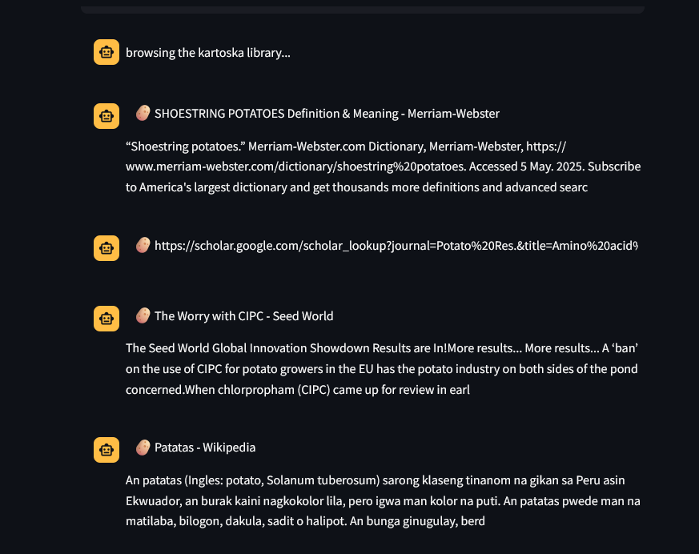

# KARTOSHKA™ — Empowering Tubercular Discovery in the Age of Infinite Data.
Introducing KARTOSHKA™ — the next-generation, AI-enhanced, blockchain-adjacent, cloud-native, hyper-personalized Search-as-a-Service platform meticulously engineered to revolutionize how you engage with the world’s most iconic tuber: the potato. Harnessing the unparalleled power of cutting-edge algorithms, machine learning, and synergistic data fusion, KARTOSHKA delivers real-time, scalable, and context-aware insights into every conceivable aspect of your favorite starchy superfood. From farm-to-fork traceability and genomic optimization, to deep-fried ideation ecosystems and cultural zeitgeist analytics, KARTOSHKA is not just a search engine — it’s a holistic, immersive, end-to-end potato intelligence solution for the modern age.

Redefine your relationship with the root. Welcome to the future. Welcome to KARTOSHKA™.

--- 

## Setup
Now, the path to installing this glorifying piece of software on your very own personal computer™️ is very, very short.

### Prerequisites
- Python
- pip
- Docker
#### Dependencies
see `requirements.txt`.

### Steps
1. **Clone the repository**:
   ```bash
   git clone git@gitlab.switch.ch:<group>/<repository>.git
   cd <repository>
   ```

2. **Create and activate a virtual environment**:
   ```bash
   python -m venv venv
   source venv/bin/activate  # For Linux/Mac
   venv\Scripts\activate     # For Windows
   ```

3. **Install dependencies**:
   ```bash
   pip install -r requirements.txt
   ```

4. **Verify Data location**:
  Jokes on you, we don't do that here. all data comes pre-downloaded when you clone the git repo!

### Configuration
| Variable      | Description                           | Location            |
| ------------- | ------------------------------------- | ------------------- |
| `MAX_RESULTS` | Max number of search results returned | `.env` |
|`Data / Keywords`| determines the data used for your queries | `data/keywords.txt` / `data/out_v1.json` |
- if you wish to reconfigure / change what data is used, see `minify-json` & `web-scraper`
#### Addendum: No Sysargs?
Yes - i *actively* decided to ditch system args in favor of a proper .env file, due to the following reasons:
- Cleaner Storage
  - Environment files are a cleaner way to manage your applications dearest secrets
- Pure Server-side solution
  - Since there is no proper way for me to use systemargs in the first place, i might aswell let them be.

##### If that's not enough:
```python
import sys

print('This is arg[1]:', sys.argv[1])
```
---

## Running KARTOSHKA™
Can all be done with one simple command:
`docker-compose up`
If you however wish to only run a selected component, see the `MAKEFILE` for possible options!

---

## Examples
Once you've entered the Web-UI, you've got a couple (exactly one) option:
- enter the search term you want to look for into the input box below! KARTOSHKA™ will then process your request, and spit out `25 (or if MAX_RESULTS specified in .env)` results according to your query!

### Example outputs
- Search term:`potato`
  - 

---